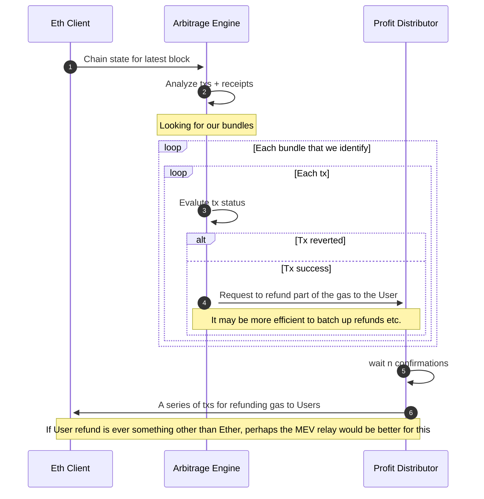
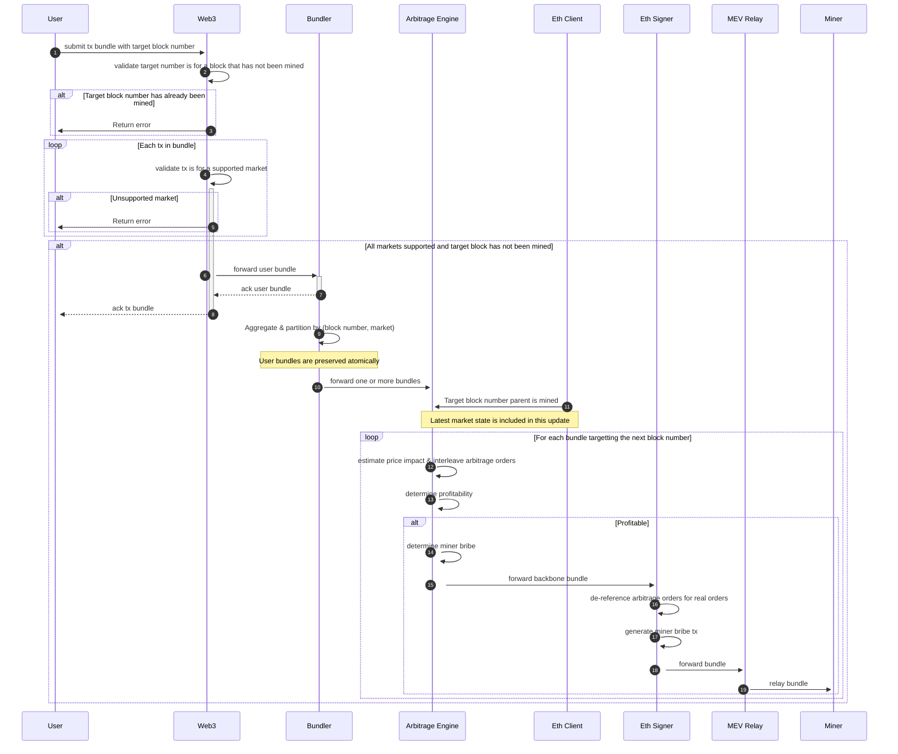
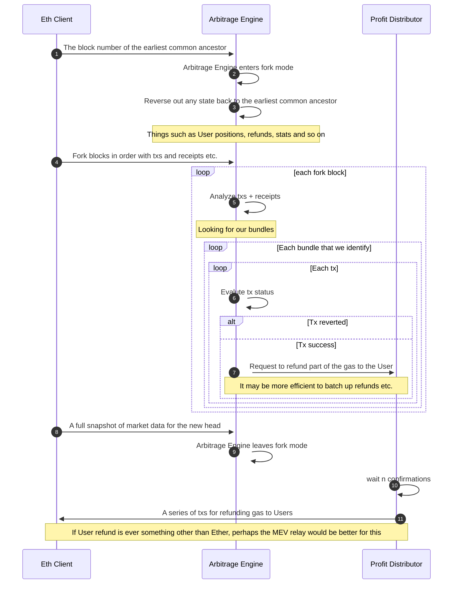

## Submit Tx 

```mermaid
sequenceDiagram
    autonumber
    Eth Client->>+Arbitrage Engine: Chain state for latest block
    Arbitrage Engine->>+Arbitrage Engine: Analyze txs + receipts
    Note over Arbitrage Engine,Arbitrage Engine: Looking for our bundles
    loop Each bundle that we identify
        loop Each tx
            Arbitrage Engine->>+Arbitrage Engine: Evalute tx status
            alt Tx reverted
            else Tx success
                Arbitrage Engine->>+Profit Distributor: Request to refund part of the gas to the User
                Note over Arbitrage Engine,Profit Distributor: It may be more efficient to batch up refunds etc.
            end
        end
    end
    Profit Distributor->>+Profit Distributor: wait n confirmations
    Profit Distributor->>+Eth Client: A series of txs for refunding gas to Users
    Note over Profit Distributor,Eth Client: If User refund is ever something other than Ether, perhaps the MEV relay would be better for this
```

### Submit Tx Bundle

```mermaid 
sequenceDiagram
    autonumber
    User->>+Web3: submit tx bundle with target block number
    Web3->>+Web3: validate target number is for a block that has not been mined
    alt Target block number has already been mined
        Web3->>+User: Return error
    end
    loop Each tx in bundle
        Web3->>+Web3: validate tx is for a supported market
        alt Unsupported market
            Web3->>+User: Return error
        end

    end
    alt All markets supported and target block has not been mined
        Web3->>+Bundler: forward user bundle
        Bundler-->>-Web3: ack user bundle
        Web3-->>-User: ack tx bundle
        Bundler->>+Bundler: Aggregate & partition by (block number, market)
        Note over Bundler,Bundler: User bundles are preserved atomically
        Bundler->>+Arbitrage Engine: forward one or more bundles
        Eth Client->>+Arbitrage Engine: Target block number parent is mined
        Note over Eth Client,Arbitrage Engine: Latest market state is included in this update
        loop For each bundle targetting the next block number
            Arbitrage Engine->>+Arbitrage Engine: estimate price impact & interleave arbitrage orders
            Arbitrage Engine->>+Arbitrage Engine: determine profitability
            alt Profitable
                Arbitrage Engine->>+Arbitrage Engine: determine miner bribe
                Arbitrage Engine->>+Eth Signer: forward backbone bundle
                Eth Signer->>+Eth Signer: de-reference arbitrage orders for real orders
                Eth Signer->>+Eth Signer: generate miner bribe tx
                Eth Signer->>+MEV Relay: forward bundle
                MEV Relay->>+Miner: relay bundle
            end
        end
    end
```

### Profit Distribution

```mermaid 
sequenceDiagram
    autonumber
    Eth Client->>+Arbitrage Engine: Chain state for latest block
    Arbitrage Engine->>+Arbitrage Engine: Analyze txs + receipts
    Note over Arbitrage Engine,Arbitrage Engine: Looking for our bundles
    loop Each bundle that we identify
        loop Each tx
            Arbitrage Engine->>+Arbitrage Engine: Evalute tx status
            alt Tx reverted
            else Tx success
                Arbitrage Engine->>+Profit Distributor: Request to refund part of the gas to the User
                Note over Arbitrage Engine,Profit Distributor: It may be more efficient to batch up refunds etc.
            end
        end
    end
    Profit Distributor->>+Profit Distributor: wait n confirmations
    Profit Distributor->>+Eth Client: A series of txs for refunding gas to Users
    Note over Profit Distributor,Eth Client: If User refund is ever something other than Ether, perhaps the MEV relay would be better for this
```

### Handling Fork 

```mermaid 
sequenceDiagram
    autonumber
    Eth Client->>+Arbitrage Engine: The block number of the earliest common ancestor
    Arbitrage Engine->>+Arbitrage Engine: Arbitrage Engine enters fork mode
    Arbitrage Engine->>+Arbitrage Engine: Reverse out any state back to the earliest common ancestor
    Note over Arbitrage Engine, Arbitrage Engine: Things such as User positions, refunds, stats and so on
    Eth Client->>+Arbitrage Engine: Fork blocks in order with txs and receipts etc.
    loop each fork block
        Arbitrage Engine->>+Arbitrage Engine: Analyze txs + receipts
        Note over Arbitrage Engine,Arbitrage Engine: Looking for our bundles
        loop Each bundle that we identify
            loop Each tx
                Arbitrage Engine->>+Arbitrage Engine: Evalute tx status
                alt Tx reverted
                else Tx success
                    Arbitrage Engine->>+Profit Distributor: Request to refund part of the gas to the User
                    Note over Arbitrage Engine,Profit Distributor: It may be more efficient to batch up refunds etc.
                end
            end
        end
    end
    Eth Client->>+Arbitrage Engine: A full snapshot of market data for the new head
    Arbitrage Engine->>+Arbitrage Engine: Arbitrage Engine leaves fork mode
    Profit Distributor->>+Profit Distributor: wait n confirmations
    Profit Distributor->>+Eth Client: A series of txs for refunding gas to Users
    Note over Profit Distributor,Eth Client: If User refund is ever something other than Ether, perhaps the MEV relay would be better for this
```
